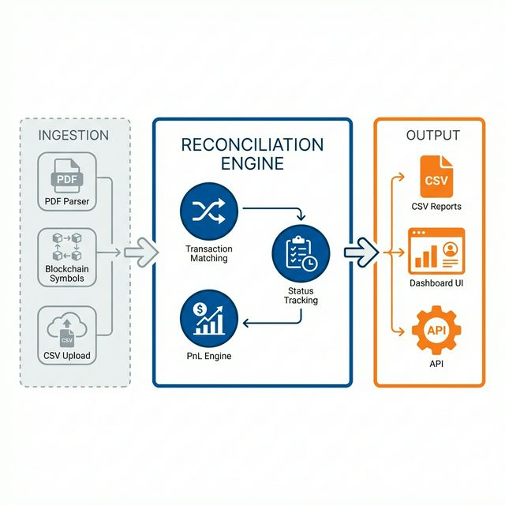

# OTC Treasury Reconciliation System



**Portfolio Project by Gilang Fajar Wijayanto**  
Senior Treasury & Finance Operations Specialist | CFA Level I | FRM Part I  
[delomite.com](https://delomite.com) | [LinkedIn](https://www.linkedin.com/in/gilang-fajar-6973119a/)

---

## 📋 Overview

This repository demonstrates a **production-grade OTC Reconciliation System** designed for high-volume treasury operations at licensed fintech firms. It solves the critical challenge of matching multi-leg cryptocurrency transactions (Crypto + Fiat) and ensuring zero-error PnL recognition under regulatory compliance.

### Business Context
In OTC crypto trading, each transaction involves two settlement legs:
1. **Crypto Leg**: Wallet transfer (USDT, USDC, BTC, PAXG)
2. **Fiat Leg**: Bank transfer (IDR)

**The Challenge**: PnL can only be recognized when BOTH legs are confirmed. Premature recognition leads to incorrect financial reporting, tax leakage, and liquidity miscalculation.

### Key Features
- ✅ **Dual-Leg Settlement Matching**: Automatically pairs crypto wallet transfers with bank statement credits/debits
- ✅ **Conservative PnL Recognition**: Profit recognized only upon full settlement of both legs
- ✅ **Real-Time Discrepancy Monitoring**: Flags settlement lags >8 hours and reconciliation breaks
- ✅ **Live Pricer API**: FastAPI-based quote engine with custom spreads and OJK 0.21% tax
- ✅ **Interactive Dashboard**: Zero-fetch HTML dashboard with USD/IDR currency conversion
- ✅ **Comprehensive Analytics**: Jupyter notebook with pair-wise, monthly, and client analysis

---

## 📊 System Metrics (FY 2024 Synthetic Dataset)

| Metric | Value |
|--------|-------|
| **Total Transactions** | 5,968 |
| **Settled Transactions** | 5,537 (92.8% settlement rate) |
| **Total Volume** | IDR 18.2T (~$1.2B USD) |
| **Net PnL** | IDR 41.4B (~$2.7M USD) |
| **Gross Spread** | IDR 50.0B |
| **Tax Paid** | IDR 8.6B (0.21% regulatory) |
| **Blended Spread** | 30 bps (volume-weighted) |

### Pair Breakdown
| Pair | Net PnL | Tx Count | Avg Spread |
|------|---------|----------|------------|
| USDT/IDR | IDR 22.4B | 2,765 | 29.8 bps |
| USDC/IDR | IDR 14.3B | 1,938 | 30.2 bps |
| BTC/IDR | IDR 4.1B | 554 | 30.1 bps |
| PAXG/IDR | IDR 0.6B | 280 | 30.3 bps |

---

## 🧮 Spread Calculation Methodology

### What is Spread?
The **spread** is the difference between the price quoted to clients and the price paid to market makers, measured in **basis points (bps)** where 1 bps = 0.01%.

### Formula
```
Spread (bps) = ((Client Price - Market Maker Price) / Market Maker Price) × 10,000
```

### Transaction-Specific Logic

**For BUY transactions** (client buys crypto):
- Client pays a **higher** IDR price than our market maker cost
- Spread = (Client Price - MM Price) / MM Price × 10,000
- Example: Client pays IDR 16,000/USDT, MM charges IDR 15,952
  - Spread = (16,000 - 15,952) / 15,952 × 10,000 = **30.1 bps**

**For SELL transactions** (client sells crypto):
- Client receives a **lower** IDR price than our market maker sell price
- Spread = (MM Price - Client Price) / MM Price × 10,000
- Example: MM pays IDR 16,000/USDT, client receives IDR 15,952
  - Spread = (16,000 - 15,952) / 16,000 × 10,000 = **30.0 bps**

### Blended Spread Calculation
The **blended spread** is the volume-weighted average across all pairs:

```
Blended Spread = Σ(Spread_i × Volume_i) / Σ(Volume_i)
```

Where:
- `Spread_i` = Spread for transaction i (in bps)
- `Volume_i` = IDR volume for transaction i

**Why volume-weighted?** Large transactions have more impact on profitability than small ones, so the blended spread reflects the true economic spread.

### Spread vs PnL
```
Gross Spread (IDR) = Volume × (Spread / 10,000)
Tax (IDR) = Volume × 0.0021
Net PnL (IDR) = Gross Spread - Tax
```

---

## 🗂️ Project Structure

```
otc-reconciliation/
├── data/                          # Synthetic FY 2024 datasets
│   ├── 01_transactions.csv        # 5,968 transactions with full settlement logic
│   ├── 02_monthly_pnl.csv         # Monthly aggregated PnL
│   ├── 03_account_ledger.csv      # Dual-entry ledger (crypto + fiat legs)
│   ├── 04_pricer_template.csv     # Spread configuration by pair
│   └── ref_*.csv                  # Reference tables (clients, market makers, rates)
│
├── notebook/                      # Analytical walkthrough
│   └── otc_reconciliation.ipynb   # 22-cell Jupyter notebook with:
│                                  #   - Transaction overview & status breakdown
│                                  #   - Pair-wise performance analysis
│                                  #   - Spread calculation methodology
│                                  #   - Monthly PnL trends
│                                  #   - Top client analysis
│                                  #   - Settlement delay detection
│
├── pricer/                        # FastAPI pricing engine
│   ├── main.py                    # API endpoints (/quote, /params, /health)
│   ├── models.py                  # Pydantic request/response schemas
│   ├── config.py                  # Spread configuration and tax rates
│   └── requirements.txt           # Dependencies (fastapi, uvicorn, pandas)
│
├── dashboard/                     # Interactive reconciliation dashboard
│   └── index.html                 # Zero-fetch HTML dashboard (47KB)
│                                  #   - Premium Delomite design
│                                  #   - USD/IDR currency conversion
│                                  #   - Real-time FX rate input
│                                  #   - 4 pages: Overview, P&L, Transactions, Pricer
│
├── embeds/                        # Standalone chart embeds for articles
│   ├── monthly_pnl.html           # Monthly PnL bar chart
│   ├── pair_breakdown.html        # Pair performance donut chart
│   ├── settlement_status.html     # Status distribution
│   ├── client_ranking.html        # Top clients horizontal bar
│   └── spread_distribution.html   # Spread box plot by pair
│
├── diagrams/                      # System architecture
│   └── architecture_flow.png      # Data flow diagram
│
├── generate_data.py               # Synthetic data generator (GBM for rates)
├── generate_embeds.py             # Chart embed generator
├── optimize_dashboard.py          # Dashboard data aggregation script
└── README.md                      # This file
```

---

## 🚀 Getting Started

### Prerequisites
- Python 3.9+
- Modern web browser (Chrome, Firefox, Safari)
- (Optional) Jupyter Notebook or Google Colab

### 1. Clone the Repository
```bash
git clone https://github.com/yourusername/otc-reconciliation.git
cd otc-reconciliation
```

### 2. Explore the Analytical Walkthrough
Open `notebook/otc_reconciliation.ipynb` in:
- **Google Colab**: Upload the notebook and data folder
- **Jupyter Notebook**: `jupyter notebook notebook/otc_reconciliation.ipynb`

The notebook contains:
- Transaction overview and status breakdown
- Pair-wise performance analysis with spread calculations
- Monthly PnL trends across FY 2024
- Top 8 client analysis and concentration risk
- Settlement delay detection (>8 hour SLA violations)

### 3. Run the Pricer API
```bash
cd pricer
pip install -r requirements.txt
uvicorn main:app --reload
```

**Test the API:**
```bash
# Get a quote
curl -X POST http://localhost:8000/quote \
  -H "Content-Type: application/json" \
  -d '{
    "pair": "USDT/IDR",
    "direction": "BUY",
    "volume_crypto": 1000,
    "client_name": "PT Test Client"
  }'

# Check health
curl http://localhost:8000/health
```

### 4. View the Interactive Dashboard

**Option A: Auto-Opener Script**
```bash
python3 start_dashboard.py
```

**Option B: Manual Server**
```bash
# Using Python
python3 -m http.server 8000

# Using Node
npx serve .
```

Then visit: [http://localhost:8000/dashboard/](http://localhost:8000/dashboard/)

**Dashboard Features:**
- **Overview Page**: KPI strip, monthly PnL chart, pair breakdown, top clients
- **P&L Analysis**: Detailed pair performance, gross spread, tax breakdown
- **Transactions**: Filterable ledger with latest 20 settled transactions
- **Pricer**: Interactive quote calculator with real-time spread application
- **Currency Toggle**: Switch between IDR and USD with custom FX rate

---

## 📐 Technical Implementation

### Data Generation
The synthetic dataset uses **Geometric Brownian Motion (GBM)** to simulate realistic market rates:

```python
dS = μ × S × dt + σ × S × dW
```

Where:
- `μ` = drift (daily return)
- `σ` = volatility
- `dW` = Wiener process (random walk)

This ensures realistic price movements while maintaining statistical properties of actual crypto markets.

### Settlement Logic
```python
if crypto_settled_at AND fiat_settled_at:
    pnl_recognition_timestamp = max(crypto_settled_at, fiat_settled_at)
    status = "SETTLED"
    recognize_pnl(net_pnl_idr)
else:
    status = "PENDING" | "RECONCILING" | "FAILED"
    net_pnl_idr = 0  # No recognition until both legs settle
```

### Dashboard Optimization
The dashboard uses a **zero-fetch architecture**:
1. `optimize_dashboard.py` pre-aggregates data from CSV files
2. Injects JSON arrays directly into HTML `<script>` tags
3. Client-side JavaScript renders charts and tables
4. Result: 47KB self-contained HTML file (no external dependencies)

---

## 📈 Business Logic & Compliance

### Supported Pairs
- **USDT/IDR**: Tether stablecoin (50% of volume)
- **USDC/IDR**: USD Coin stablecoin (35% of volume)
- **BTC/IDR**: Bitcoin (10% of volume)
- **PAXG/IDR**: Pax Gold (5% of volume)

### Regulatory Compliance
- **OJK Tax**: 0.21% applied on all client-facing IDR amounts
- **Settlement SLA**: 8-hour maximum gap between crypto and fiat legs
- **PnL Recognition**: Conservative approach (both legs must settle)
- **Audit Trail**: Full dual-entry ledger with timestamps

### Risk Controls
- Real-time discrepancy flagging
- Settlement delay monitoring
- Client concentration tracking (top 3 clients = 32.6% of PnL)
- Pair-wise spread variance analysis

---

## 🎯 Use Cases

This system is designed for:
- **Treasury Operations Teams**: Daily reconciliation and PnL reporting
- **Finance Controllers**: Month-end close and audit preparation
- **Risk Managers**: Settlement delay monitoring and exposure tracking
- **Business Analysts**: Client profitability and pair performance analysis
- **Regulators/Auditors**: Transparent audit trail and compliance verification

---

## 🔮 Future Enhancements

- [ ] **Looker Studio Integration**: Interactive BI dashboard (in progress)
- [ ] **Automated Bank Statement Scraping**: PDF parsing for fiat leg confirmation
- [ ] **On-Chain Confirmation Alerts**: Real-time blockchain monitoring
- [ ] **Market Maker API Integration**: Automated hedging execution
- [ ] **Multi-Currency Support**: Expand beyond IDR (SGD, MYR, THB)
- [ ] **Machine Learning**: Predictive settlement delay detection

---

## 📝 License

This project is for **portfolio demonstration purposes**. The data is synthetic and does not represent any real entity.

---

## 🤝 Contact

**Gilang Fajar Wijayanto**  
Senior Treasury & Finance Operations Specialist  
📧 gilang.fajar66@gmail.com  
🌐 [delomite.com](https://delomite.com)  
💼 [LinkedIn](https://www.linkedin.com/in/gilang-fajar-6973119a/)

**Certifications:**
- CFA Level I (Passed)
- FRM Part I (Passed)
- WMI (Wakil Manajer Investasi) – OJK Indonesia
- WPPE (Wakil Penasihat Efek) – OJK Indonesia

---

**Built with:** Python, Pandas, FastAPI, Chart.js, Jupyter Notebook  
**Designed for:** Treasury Operations, Finance Control, Risk Management
